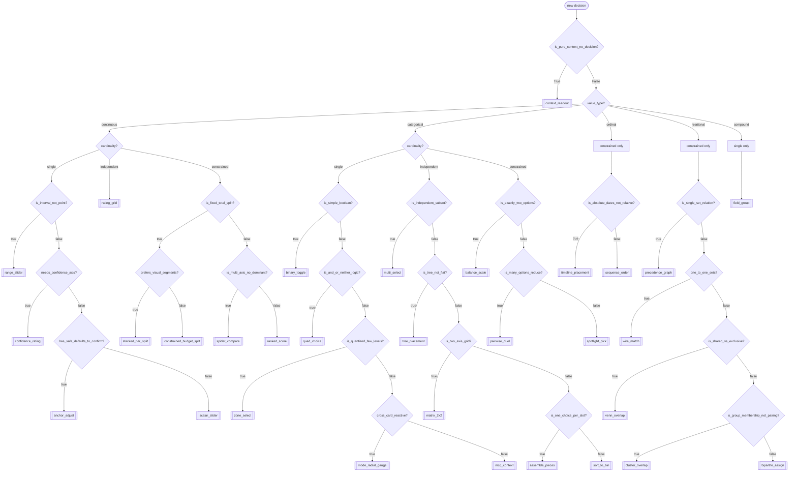

# Card-type decision tree (v2)

Which of the 31 gated Decision HUD card types to use, as a flowchart.
Derived
directly from the rule table (`_CARD_TYPE_RULES` in `backend-plugin/db.py`)
and the frontend renderer map (`CARD_RENDERERS` in `plugin.js`). Where this
doc and the code disagree, the code wins.

This supersedes the v1 taxonomy (12 ad-hoc bucket names: `scalar`,
`discrete_choice`, `compare_tradeoff`, `categorize`, `rank_sequence`,
`mapping`, `compose`, `membership`, `recommend_override`,
`reactive_config`, `none_of_these`, `info_only`). v2 replaces 11 of those
12 with a 2-axis categorical assessment — **value_type** × **cardinality**
— and closes every former `no_match` dead end with a real card type.

## How to read it

Three steps:

1. **Pre-gate**: is anything being decided at all? No → `context_readout`,
   stop here. Yes → continue.
2. **Categorical assessment**: what `value_type` is the answer (continuous
   / categorical / ordinal / relational / compound), and what `cardinality`
   (single item / independent set / constrained set)? This picks the
   bucket.
3. **Discriminants**: answer that bucket's questions (its own booleans,
   covering every card_type in it) to resolve the exact `card_type`.

Call `decision_classify_card_type` with no `bucket` to get the live list of
buckets, their card_types, and their discriminant keys straight from the
rule table — no need to read `db.py` by hand. Pass `bucket` +
`answers_json` to resolve.

## Why value_type × cardinality

- **value_type** — what kind of thing is the answer: a number
  (`continuous`), a label (`categorical`), a position among related items
  (`ordinal`), a relationship between items (`relational`), or several
  linked fields that aren't one scalar or one category (`compound`).
- **cardinality** — how many items get that value, and whether they're
  decided independently or jointly: one item (`single`), several items
  each decided on their own (`independent`), or several items bound
  together — a sum, a comparison, a sequence, a pairing (`constrained`).

`ordinal` and `relational` have no `single` or `independent` cells —
both need ≥2 related items by definition, so only `constrained` applies.

## Flowchart

Every one of these 9 matrix buckets is now a **total, non-overlapping
chain** — every boolean combination resolves to exactly one card_type,
proven exhaustively in
`backend-plugin/tests/test_card_type_enforcement.py::test_every_bucket_rule_set_is_total_and_partitioned`.
`no_match` can now only happen by naming a bucket that doesn't exist.

## Quick reference

| # | card_type | bucket | Use when… |
|---|---|---|---|
| 1 | `context_readout` | info_only | Nothing to decide — just show state/context |
| 2 | `range_slider` | continuous_single | Answer is a min–max band |
| 3 | `confidence_rating` | continuous_single | One value **plus** "how sure are you?" |
| 4 | `anchor_adjust` | continuous_single | Every field has a recommended value; confirm or nudge |
| 5 | `scalar_slider` | continuous_single | One number / setting, nothing else |
| 6 | `rating_grid` | continuous_independent | Rate N items independently, no total, no comparison |
| 7 | `stacked_bar_split` | continuous_constrained | Parts sum to a fixed total, ~3 parts, one bar |
| 8 | `constrained_budget_split` | continuous_constrained | Parts sum to a fixed total, separate sliders |
| 9 | `spider_compare` | continuous_constrained | 3–4 options across ≥3 criteria, none dominant |
| 10 | `ranked_score` | continuous_constrained | Score items on one axis, Fibonacci scale, live re-rank |
| 11 | `binary_toggle` | categorical_single | A single on/off switch |
| 12 | `quad_choice` | categorical_single | Two factors: A, B, both, or neither |
| 13 | `zone_select` | categorical_single | One of a few exclusive ordered tiers |
| 14 | `mode_radial_gauge` | categorical_single | Picking a mode visibly moves a live gauge |
| 15 | `mcq_context` | categorical_single | Nothing else in this bucket fits |
| 16 | `multi_select` | categorical_independent | "Select all that apply" |
| 17 | `tree_placement` | categorical_independent | Items go into nested categories |
| 18 | `matrix_2x2` | categorical_independent | Items placed on two independent axes |
| 19 | `assemble_pieces` | categorical_independent | Named slots, each with its own option list |
| 20 | `sort_to_bin` | categorical_independent | Items go into flat buckets |
| 21 | `balance_scale` | categorical_constrained | Exactly two alternatives weighed against each other |
| 22 | `pairwise_duel` | categorical_constrained | ≥5 options to whittle down head-to-head |
| 23 | `spotlight_pick` | categorical_constrained | 3–4 options, one named deciding factor |
| 24 | `timeline_placement` | ordinal_constrained | Items land on real calendar dates |
| 25 | `sequence_order` | ordinal_constrained | Items in relative order (first → last) |
| 26 | `precedence_graph` | relational_constrained | Directed edges within one set ("which blocks which") |
| 27 | `wire_match` | relational_constrained | Pair each item in set A with one in set B |
| 28 | `venn_overlap` | relational_constrained | Two sets — shared vs exclusive membership |
| 29 | `cluster_overlap` | relational_constrained | 3+ overlapping groups, items can belong to several |
| 30 | `bipartite_assign` | relational_constrained | Many-to-many assignment between two named sides |
| 31 | `field_group` | compound_single | Several linked fields (a date range, a schedule, a color) |

31 gated card_types reachable through `_CARD_TYPE_RULES`, plus one orphan
(`weighted_allocation`, see Known issue below) = 32 total `CARD_RENDERERS`
entries in `plugin.js`.

## Known issue

`weighted_allocation` has a `CARD_RENDERERS` entry in `plugin.js` but no
rule in `_CARD_TYPE_RULES` — unreachable, `_verify_card_type` rejects any
push naming it. Pre-dates v2 and is out of scope here; see the "Gaps"
history in this file's git log for the original v1 discussion. Either give
it a discriminant inside `continuous_constrained` (distinct from
`ranked_score`/`spider_compare`/the two splits) or delete the renderer.
